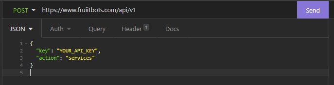
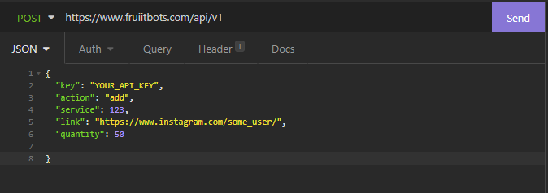
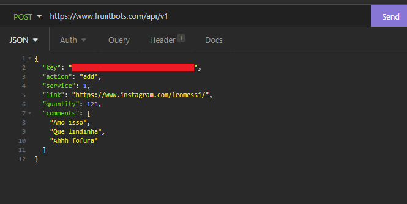
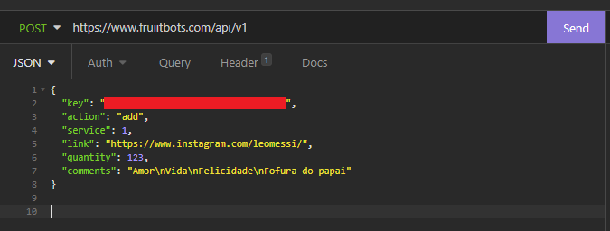
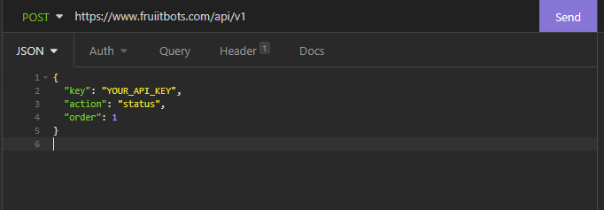
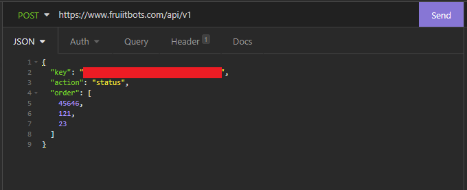
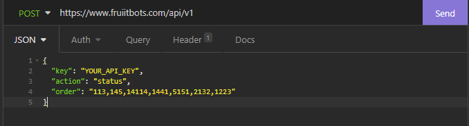
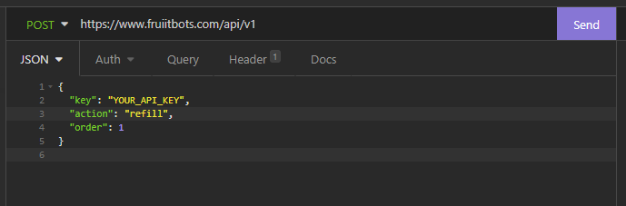

# Funcionalidades disponíveis para os serviços SMM
A url base para os serviços SMM é: **https://www.fruiitbots.com/api/v1**

**Nota:** você pode passar as informações em formato JSON no corpo da requisição, ou em forma de raw. O sistema suporta ambas as formas.

## Obtenha a lista de serviços SMM disponíveis
### Exemplo em Python
```{.py3 linenums="1"} 
from httpx import post

data = {
    "key": "YOUR_API_KEY",
    "action": "services"
}

response = post(
    url='https://www.fruiitbots.com/api/v1',
    data=data
)

print(response.json())
```

### Exemplo com Insomnia


### Exemplo de resposta 

```
[
	{
		"cancel": false,
		"category": "Instagram - Seguidores BOTS 🤖 [Recomendado para GNI / Dizu / Contas Fake] 🤖",
		"max": 10000,
		"min": 20,
		"name": "Instagram Seguidores BOTS - Sem Reposicao - (20/5k)Dia",
		"rate": 1.3,
		"refill": false,
		"service": 80,
		"type": "Default"
	},
	{
		"cancel": false,
		"category": "Instagram - 👀 Visualizações 👀",
		"max": 15000,
		"min": 100,
		"name": "Instagram salvar post (10/15k) [IGtv, funciona para tudo]",
		"rate": 0.3,
		"refill": false,
		"service": 86,
		"type": "Default"
	},
]
   
```


## Realizar pedido

### Exemplo em Python (Pedido Comum)
```{.py3 linenums="1"} 
from httpx import post

data = {
    "key": "YOUR_API_KEY",
    "action": "add",
    "service": 12,
    "quantity": 500,
    "link": "https://youtu.be/f_zLB1CTXlQ"
}

response = post(
    url='https://www.fruiitbots.com/api/v1',
    data=data
)

print(response.json())
```

### Exemplo em Python (Pedido de Comentários)
```{.py3 linenums="1"} 
from httpx import post

# Modo 1: Comentário em forma de lista / array.
data = {
    "key": "YOUR_API_KEY",
    "action": "add",
    "service": 12,
    "quantity": 500,
    "link": "https://www.instagram.com/p/CZ7JPlyDmHL/",
    "comments": [
        "comentario 1", 
        "comentário 2", 
        "comentário 3", 
        "comentário 4"
    ]
}

# Modo 2: Comentário em linha única separado por \n
data = {
    "key": "YOUR_API_KEY",
    "action": "add",
    "service": 12,
    "quantity": 500,
    "link": "https://www.instagram.com/p/CZ7JPlyDmHL/",
    "comments": "comentario 1\ncomentário 2\ncomentário 3\ncomentário 4"
}

response = post(
    url='https://www.fruiitbots.com/api/v1',
    data=data
)

print(response.json())
```


### Exemplo com Insomnia (Pedido Comum)



### Exemplo com Insomnia (Pedido de Comentários Modo 1)



### Exemplo com Insomnia (Pedido de Comentários Modo 2)



### Exemplo de resposta 

```
{
    "order": 64562
}    
   
```

## Cheque o status de um pedido

### Exemplo em Python
```{.py3 linenums="1"} 
from httpx import post

data = {
    "key": "YOUR_API_KEY",
    "action": "status",
    "order": 64562,
}

response = post(
    url='https://www.fruiitbots.com/api/v1',
    data=data
)

print(response.json())
```


### Exemplo com Insomnia


### Exemplo de resposta 

```
{
    "charge": "0.27",
    "start_count": "3572",
    "status": "Partial",
    "remains": "157",
    "currency": "BRL"
}   
   
```
## Cheque o status de vários pedidos simultaneamente

### Exemplo em Python
```{.py3 linenums="1"} 
from httpx import post

# Modo 1: Lista/Array com os ID's dos pedidos.
data = {
    "key": "YOUR_API_KEY",
    "action": "status",
    "order": [
        11314, 
        4141, 
        2132, 
    ],
}

# Modo 2: ID's dos pedidos separados por vírgula.
data = {
    "key": "YOUR_API_KEY",
    "action": "status",
    "order": "11314,4141,2132"
}

response = post(
    url='https://www.fruiitbots.com/api/v1',
    data=data
)

print(response.json())
```


### Exemplo com Insomnia - Modo 1


### Exemplo com Insomnia - Modo 2


### Exemplo de resposta 

```
{
    "11314": {
        "charge": "0.27",
        "start_count": "3572",
        "status": "Partial",
        "remains": "157",
        "currency": "BRL"
    },
    "4141": {
        "error": "Incorrect order ID"
    },
    "2132": {
        "charge": "1.44",
        "start_count": "234",
        "status": "In progress",
        "remains": "10",
        "currency": "BRL"
    }
} 
   
```

## Refil de um pedido

** Nota:** Os paineis SMM mais modernos estão implementando refil automático, visto que o refil manual segue um formato rudimentar, com uma série de problemáticas técnicas. Caso você venha ser um revendedor, opte por fazer o mesmo. No geral, a Fruiitbots possui poucos serviços com refil manual habilitado, focamos em distribuir serviços que com refil automatizado, sem quaisquer interações humanas no processo. Dito isto, caso ocorra a situação de haver refil manual.. siga os passos abaixo.


## Exemplo em Python

```{.py3 linenums="1"} 
from httpx import post

data = {
    "key": "YOUR_API_KEY",
    "action": "refill",
    "order": 1
}

response = post(
    url='https://www.fruiitbots.com/api/v1',
    data=data
)

print(response.json())
```

### Exemplo com Insomnia



### Exemplo de resposta 

```
{
    "success": "Your order will be refill asap. Thank you for patience."
}
    
```