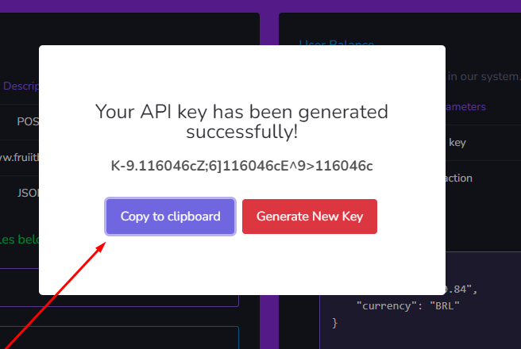
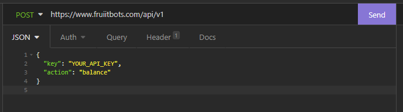

# Introdução 
## Bem vindos à documentação da API - FruiitBots

Esta documentação foi criada, com o intuito de auxiliar os desenvolvedores ou parceiros, que possuem o interesse de integrar o nosso sistema, da FruiitBots.  

Desenvolvemos uma API, na qual disponibilizaremos serviços para serem adquiridos, cancelados, extornados e seus preços consultados.  Você pode utilizar a linguagem de programação, ou software que realize solicitações HTTP de sua preferência.   

Softwares conhecidos como o [Insomnia](https://insomnia.rest/) ou [Postman](https://www.postman.com/) são bastante úteis, para quem não está habituado com linguagens de programação ou desejam realizar testes pontuais.  

No geral, faremos exemplos utilizando a linguagem de programação Python acompanhado de um exemplo no Insomnia. 


## Autenticação

Todas as chamadas da API, solicitarão uma chave de API. Essa chave de API só pode ser gerada por usuários que possuem contas ativas na FruiitBots. Se você ainda não possui uma conta [clique aqui](https://www.fruiitbots.com/criar_conta).

Uma vez com uma conta ativa em nosso sistema, se dirija a seguinte seção de  [API](https://www.fruiitbots.com/painel/api) , gere uma chave de API e guarde-a em um local seguro que somente você tem acesso.

### Gerando a chave de API


### Copiando a chave de API



## Obtenha o seu saldo na FruiitBots

**Nota:** você pode passar as informações em formato JSON no corpo da requisição, ou em forma de raw. O sistema suporta ambas as formas.

### Exemplo em Python
```{.py3 linenums="1"} 
from httpx import post

data = {
    "key": "YOUR_API_KEY",
    "action": "balance"
}

response = post(
    url='https://www.fruiitbots.com/api/v1',
    data=data
)

print(response.json())
```

### Exemplo com Insomnia


### Exemplo de resposta 

```
{
	"balance": 20.40,
	"currency": "BRL"
}
   
```


## Responsabilidades

Todos os serviços via API ou Painel da FruiitBots  e seus sistemas dependentes, estão assegurados pelos [Termos de Uso](https://www.fruiitbots.com/termos) e [Política de Privacidade](https://www.fruiitbots.com/politica) da [Fruiitbots](https://www.fruiitbots.com/). Por meio deles, deixamos de forma clara a nossa isenção por quaiser erros, ou problemas ocasionados por serviços de terceiros e/ou erro intencional (ou não) do usuário que estiver fazendo o uso de nossos sistemas, de forma incorreta.

Salientamos também que a Fruiitbots, reserva o direito de a qualquer momento poder suspender o acesso à API, ou sistema administrado por ela, em caso de identificação de má fé, ou atividades maliciosas, ou descumprimento dos termos por parte do usuário. Sem quaisquer resarcimentos ou aviso prévio. 
